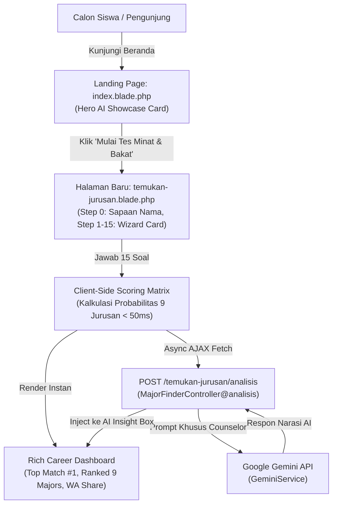

# Design Specification: Smeas AI Major Finder (Tes Probabilitas Jurusan)

- **Date:** 2026-10-04
- **Project:** JHIC-Smeas-v2 (SMKN 1 Surabaya Career Center & Portal)
- **Status:** Approved by User

---

## 1. Overview & Objectives

Website utama SMKN 1 Surabaya saat ini memiliki section *"Temukan Jurusanmu, Buka Peluang Karirmu"* pada halaman beranda (`resources/views/index.blade.php`). Section tersebut sebelumnya hanya menyediakan input teks pencarian standar yang mengarahkan pengguna ke halaman direktori jurusan statis (`/jurusan`).

Tujuan proyek ini adalah:
1. Mengubah section *"Temukan Jurusanmu"* di landing page menjadi **Hero Showcase Banner interaktif "Smeas AI Major Finder"** berpenampilan modern dan bernuansa AI.
2. Mengarahkan pengunjung ke halaman baru khusus (`/temukan-jurusan`) yang berisi kuesioner interaktif 15 pertanyaan berbasis skala Likert (STS hingga SS).
3. Menghitung probabilitas kecocokan minat siswa terhadap 9 jurusan resmi di SMKN 1 Surabaya secara instan dan deterministik menggunakan matriks pembobotan.
4. Mengintegrasikan Google Gemini AI (`GeminiService`) secara asinkron untuk memberikan narasi evaluasi personal, rekomendasi karir masa depan, serta motivasi belajar.
5. Menyediakan fitur berbagi hasil ke WhatsApp (*pre-filled template message*), salin link hasil, dan navigasi langsung ke pendaftaran SPMB atau silabus jurusan terkait.

---

## 2. Technical Stack & Architectural Decisions

- **Framework**: Laravel 13.x (PHP 8.3/8.5), Tailwind CSS v4, Vite, Blade templates.
- **AI Integration**: Google Gemini API (`gemini-1.5-flash`) via existing `App\Services\Chatbot\GeminiService`.
- **Interaction Engine**: Client-side interactive wizard (Vanilla JS / Alpine.js) untuk zero-latency transitions, digabungkan dengan panggilan AJAX asinkron untuk pemanggilan analisis naratif AI.
- **Storage/Session**: Bebas registrasi wajib / anonim. Nama panggilan diinputkan saat mulai untuk personalisasi sapaan. Jawaban kuesioner diproses di sisi klien tanpa perlu persistensi database berat, dengan opsi rate-limiting (`throttle:20,1`) pada endpoint AI.



---

## 3. Routes & Controller Specifications

### 3.1 Route Definitions (`routes/web.php`)
```php
use App\Http\Controllers\MajorFinderController;

// Halaman Kuesioner AI Major Finder
Route::get('/temukan-jurusan', [MajorFinderController::class, 'index'])
    ->name('temukan-jurusan');

// Endpoint AJAX Analisis AI Personal
Route::post('/temukan-jurusan/analisis', [MajorFinderController::class, 'analisis'])
    ->middleware('throttle:20,1')
    ->name('temukan-jurusan.analisis');
```

### 3.2 Controller (`App\Http\Controllers\MajorFinderController`)
File: `app/Http/Controllers/MajorFinderController.php`

#### Method `index()`
Menyiapkan metadata 9 jurusan SMKN 1 Surabaya dan 15 daftar pertanyaan, lalu me-render view `temukan-jurusan`.
- Data 9 Jurusan:
  1. `rekayasa-perangkat-lunak` (RPL): Rekayasa Perangkat Lunak, icon: `laptop-code`, tag: "Software Engineer, Web/App Developer"
  2. `teknik-komputer-dan-jaringan` (TKJ): Teknik Komputer dan Jaringan, icon: `network-wired`, tag: "Network Administrator, Hardware & Cloud"
  3. `desain-komunikasi-visual` (DKV): Desain Komunikasi Visual, icon: `palette`, tag: "Graphic Designer, UI/UX, Illustrator"
  4. `akuntansi` (AK): Akuntansi dan Keuangan Lembaga, icon: `calculator`, tag: "Auditor, Akuntan, Tax Officer"
  5. `bisnis-daring-dan-pemasaran` (BDP): Bisnis Daring dan Pemasaran, icon: `chart-line`, tag: "Digital Marketer, E-Commerce, Entrepreneur"
  6. `manajemen-perkantoran` (MP): Manajemen Perkantoran dan Layanan Bisnis, icon: `file-lines`, tag: "Executive Assistant, Document Specialist"
  7. `manajemen-logistik` (MLOG): Manajemen Logistik, icon: `boxes-stacked`, tag: "Supply Chain Planner, Warehouse Supervisor"
  8. `perhotelan` (PH): Perhotelan, icon: `hotel`, tag: "Hospitality Lead, Front Office, F&B Service"
  9. `produksi-siaran-program-pertelevisian` (PSPT): Produksi dan Siaran Program Televisi, icon: `video`, tag: "Broadcast Director, Video Editor, Scriptwriter"

#### Method `analisis(Request $request)`
- **Validasi Input**:
  - `nama`: `nullable|string|max:50`
  - `top_major`: `required|array`
  - `top_major.name`: `required|string`
  - `top_major.score`: `required|numeric`
  - `alternatives`: `nullable|array`
  - `highlights`: `nullable|array`
- **Eksekusi AI**:
  - Mengirim payload ke `GeminiService` menggunakan prompt khusus Career Counselor.
  - Memiliki fallback terpadu jika API key kosong, kuota habis, atau koneksi timeout, menghasilkan respon terstruktur yang valid.
- **Return**: `JsonResponse` berformat:
  ```json
  {
    "success": true,
    "analysis": "Narasi hasil rekomendasi AI..."
  }
  ```

---

## 4. Matriks Scoring 15 Pertanyaan ke 9 Jurusan

### 4.1 Skala Pilihan Jawaban
- **STS** (Sangat Tidak Setuju): Nilai 1
- **TS** (Tidak Setuju): Nilai 2
- **N** (Netral): Nilai 3
- **S** (Setuju): Nilai 4
- **SS** (Sangat Setuju): Nilai 5

### 4.2 Matriks Relasi Soal & Bobot Jurusan
Setiap pertanyaan memiliki bobot nilai:
- `3`: Jurusan Utama (Primer)
- `1`: Jurusan Terkait (Sekunder)

| No | Teks Pertanyaan | Primer (Bobot 3) | Sekunder (Bobot 1) |
|---|---|---|---|
| **1** | Saya sangat menikmati aktivitas yang melibatkan analisis angka, pencatatan data keuangan, atau audit laporan secara teliti. | `akuntansi` | `manajemen-perkantoran` |
| **2** | Saya suka berinteraksi dengan banyak orang, melakukan tawar-menawar, negosiasi, atau menyusun strategi jualan. | `bisnis-daring-dan-pemasaran` | `perhotelan` |
| **3** | Saya adalah orang yang sangat terorganisir, suka merapikan arsip/dokumen, dan menjaga ketepatan jadwal serta agenda kerja. | `manajemen-perkantoran` | `manajemen-logistik`, `akuntansi` |
| **4** | Saya tertarik memahami alur rantai pasok, tata kelola barang di gudang, dan efisiensi jalur distribusi logistik. | `manajemen-logistik` | - |
| **5** | Saya sangat antusias dengan dunia coding, menulis baris kode program, dan membangun sebuah aplikasi atau website dari nol. | `rekayasa-perangkat-lunak` | - |
| **6** | Saya penasaran dengan cara kerja perangkat keras komputer, perakitan komponen PC, serta konfigurasi jaringan internet/router. | `teknik-komputer-dan-jaringan` | - |
| **7** | Saya memiliki kepekaan estetika yang tinggi, senang menggambar, membuat ilustrasi digital, atau mendesain konten grafis. | `desain-komunikasi-visual` | - |
| **8** | Saya tertarik bekerja di balik layar produksi video, penyiaran televisi/radio, penyusunan naskah, atau penyutradaraan film pendek. | `produksi-siaran-program-pertelevisian` | - |
| **9** | Saya memiliki kepribadian yang ramah, berpenampilan rapi, sabar, dan senang melayani kenyamanan tamu atau pelanggan secara langsung. | `perhotelan` | `manajemen-perkantoran` |
| **10** | Saya lebih menyukai tugas yang menuntut akurasi perhitungan tinggi, kepatuhan pada aturan formal, dan minim ruang kesalahan. | `akuntansi` | `manajemen-logistik` |
| **11** | Saya suka mencari tren terbaru di media sosial, membuat materi promosi, atau mengelola toko online/marketplace. | `bisnis-daring-dan-pemasaran` | `desain-komunikasi-visual` |
| **12** | Saya merasa nyaman dan teliti saat harus mengelola surat-menyurat resmi, notulen rapat, serta layanan komunikasi perkantoran. | `manajemen-perkantoran` | - |
| **13** | Saya memiliki pola pikir logis-sistematis yang kuat untuk mencari letak kesalahan (debugging) pada suatu sistem atau alur kerja yang macet. | `rekayasa-perangkat-lunak` | `teknik-komputer-dan-jaringan` |
| **14** | Saya menyukai tantangan teknis lapangan yang membutuhkan ketahanan fisik, ketelitian tinggi, dan penyelesaian masalah jaringan secara cepat. | `teknik-komputer-dan-jaringan` | - |
| **15** | Saya senang mengekspresikan ide-ide kreatif yang unik ke dalam bentuk visual bergerak, fotografi profesional, atau identitas merek (branding). | `desain-komunikasi-visual` (bobot 2), `produksi-siaran-program-pertelevisian` (bobot 2) | `bisnis-daring-dan-pemasaran` |

### 4.3 Algoritma Perhitungan Skor & Normalisasi
1. Untuk setiap jurusan $j$, hitung skor kumulatif:
   $$Score_j = \sum_{i=1}^{15} (Jawaban_i \times Bobot_{i,j})$$
2. Tentukan skor teoritis maksimal ($Max_j$) dan skor teoritis minimal ($Min_j$) jika seluruh soal dijawab SS (5) atau STS (1).
3. Normalisasikan skor ke dalam rentang persentase 25% – 98%:
   $$Percentage_j = \min\left(98, \max\left(25, \text{round}\left(25 + \left(\frac{Score_j - Min_j}{Max_j - Min_j}\right) \times 70\right)\right)\right)$$
4. Urutkan daftar 9 jurusan dari nilai $Percentage$ tertinggi ke terendah.

---

## 5. Antarmuka Pengguna & User Experience (UX)

### 5.1 Redesign Section Landing Page (`resources/views/index.blade.php`)
Menggantikan blok form search lama menjadi:
- **Card Container**: Gradien Navy (`#024089` ke `#0b2149`) dengan radius rounded-2xl dan bayangan halus.
- **Badge**: `🤖 Smeas AI Major Finder` & `⏱️ 15 Soal • ±3 Menit`.
- **Heading**: *"Temukan Jurusan Impianmu dengan Bantuan AI"*
- **Deskripsi**: *"Ikuti kuesioner probabilitas cerdas untuk memetakan bakat, minat, dan potensi karirmu di 9 keahlian vokasi SMKN 1 Surabaya."*
- **Tombol Aksi**:
  - `Mulai Tes Minat & Bakat →` (menuju `route('temukan-jurusan')`, warna amber `#f59e0b`).
  - `Jelajahi 9 Jurusan` (menuju `route('jurusan')`, warna putih transparan).

### 5.2 Halaman Kuesioner (`resources/views/temukan-jurusan.blade.php`)
Memiliki 3 kondisi tampilan (state) mulus tanpa reload:
1. **Layar Sambutan (Intro State)**:
   - Pengenalan singkat kuesioner.
   - Input nama panggilan (opsional).
   - Tombol `Mulai Kuesioner (15 Soal) →`.
2. **Layar Wizard Kuesioner (Quiz State)**:
   - Header: Tombol kembali (`← Sebelumnya`), nomor soal aktif (`Pertanyaan X dari 15`), dan persentase progress bar.
   - Card Soal: Teks pertanyaan dengan font besar dan kontras tinggi.
   - Pilihan Likert (5 Tombol Pill):
     - `SS` - Sangat Setuju
     - `S` - Setuju
     - `N` - Netral
     - `TS` - Tidak Setuju
     - `STS` - Sangat Tidak Setuju
   - Fitur *Auto-Advance*: Begitu salah satu opsi diklik, highlight tombol aktif selama 200ms, lalu otomatis berpindah ke soal berikutnya.
3. **Layar Analisis & Loading (Evaluating State)**:
   - Animasi kalkulasi selama 600ms dengan icon AI / radar scanner.
4. **Layar Hasil (Result Dashboard State)**:
   - **Header Confetti / Selamat**: *"Hai [Nama], Ini Hasil Analisis Minat & Bakatmu!"*
   - **Hero Top Match Card**:
     - Jurusan Peringkat 1 dengan badge persentase besar (misal: `94% Kecocokan`).
     - Deskripsi singkat bidang keahlian dan tombol direct link ke profil detail jurusan.
   - **AI Personal Insight Card**:
     - Narasi mendalam dari Gemini AI mengenai karakter dan peluang karir.
     - Skeleton loader saat API sedang bekerja, kemudian fade-in teks narasi.
   - **Ranked Probabilities (9 Jurusan)**:
     - 9 bar horizontal progress dengan persentase dan link eksplorasi.
   - **Action & Sharing Toolbar**:
     - `Bagikan ke WhatsApp` (Pre-filled pesan WhatsApp).
     - `Salin Tautan` (Salin tautan web dengan toast tooltip konfirmasi).
     - `Daftar SPMB SMKN 1 Surabaya` (Direct ke `/spmb`).
     - `Ulangi Tes` (Reset state ke awal).

---

## 6. Template Pesan WhatsApp Share

Format pesan teks yang di-generate tombol bagikan WhatsApp:
```text
Halo! Saya baru saja menyelesaikan tes minat & bakat di Smeas AI Major Finder SMKN 1 Surabaya.

Hasil kecocokan jurusan saya:
🏆 1. [Nama Jurusan Top 1] ([Skor Top 1]%)
🥈 2. [Nama Jurusan Top 2] ([Skor Top 2]%)
🥉 3. [Nama Jurusan Top 3] ([Skor Top 3]%)

Yuk cari tahu jurusan yang paling cocok untukmu di SMKN 1 Surabaya juga:
https://jhic.smkn1surabaya.sch.id/temukan-jurusan
```

---

## 7. Error Handling & Edge Cases

| Skenario | Penanganan |
|---|---|
| Siswa mengosongkan nama di awal | Sistem otomatis menggunakan sapaan default *"Sobat SMEAS"*. |
| API Key Gemini kosong / kuota habis | Controller mendeteksi status dan langsung mengembalikan narasi fallback dinamis berkualitas tinggi tanpa menampilkan pesan error ke pengguna. |
| Pengguna mengklik tombol pilihan berulang kali secara cepat | Debounce 250ms pada event click sebelum beralih ke soal berikutnya. |
| Pengguna menekan tombol "Sebelumnya" di nomor 1 | Tombol dinonaktifkan / disembunyikan pada nomor 1. |
| Pengguna me-refresh halaman di tengah tes | Halaman kembali ke layar awal dengan tombol mulai yang jelas. |
| Spam request ke endpoint AI | Route dilindungi middleware `throttle:20,1`. |

---

## 8. Verification & Testing Plan

1. **Unit & Feature Testing (PHPUnit / Artisan Test)**:
   - `tests/Feature/MajorFinderTest.php`:
     - Test route `/temukan-jurusan` mengembalikan HTTP status 200 dan memuat view yang benar.
     - Test endpoint `POST /temukan-jurusan/analisis` dengan validasi request payload.
     - Test fallback response jika layanan AI tidak tersedia.
2. **Browser Validation**:
   - Memastikan landing page section *"Temukan Jurusanmu"* tampil rapi, responsif di resolusi desktop dan mobile, dan tombol CTA mengarah ke `/temukan-jurusan`.
   - Menguji alur wizard kuesioner dari nomor 1 hingga 15 dengan kombinasi pilihan berbeda (misal dominan IT vs dominan Akuntansi/Manajemen).
   - Memastikan bar persentase 9 jurusan terurut akurat dari terbesar ke terkecil.
   - Memastikan tombol share WhatsApp membuka URL WhatsApp dengan teks yang tepat.
   - Memastikan tombol salin tautan berhasil menyalin ke clipboard.
